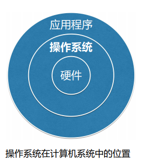

# 精讲01: 《第一章: 操作系统简介》

[TOC]

## 一、操作系统的定义

操作系统是一种复杂的系统软件，是不同程序程序代码、数据结构、数据初始化文件的集合，可执行。选择题、填空题、简答题

## 二、用户与硬件之间的接口选择题、填空题

操作系统屏蔽了对硬件的细节，提供了计算机用户与计算机硬件之间的接口，并且通过这个接口使应用程序的开发变的简单、高效。

操作系统必须完成的目标：(承上启下)

1、操作系统与硬件部分相互作用，

2、为运行在计算机上的应用程序提供执行环境。

## 三、资源的管理者

现在计算机系统的一个重要特点就是支持多任务，即允许在同一个系统内同时驻留多个应用程序。选择题、填空题

处理机管理：决定把处理机先分给哪个程序用，后给哪个程序用

内存管理：给程序分配内存空间

设备管理：完成怎么分配设备，分配哪台设备，怎么和设备连接等

文件管理：为每个文件分配空间、建立目录，对目录进行组织管理以及根据用户请求从外存读取数据或将数据写入外存

