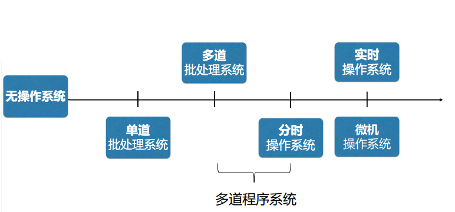
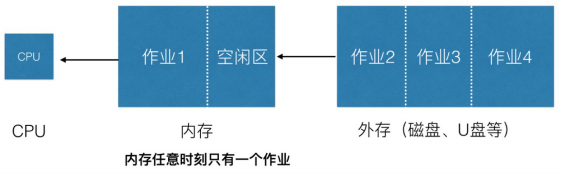
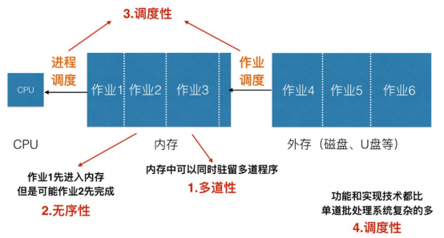
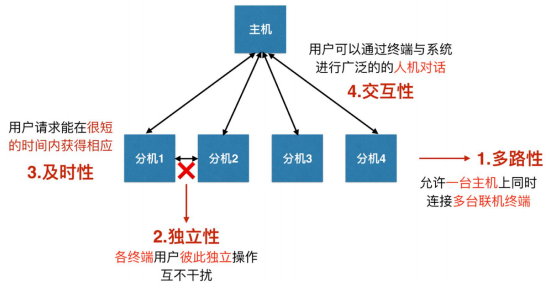
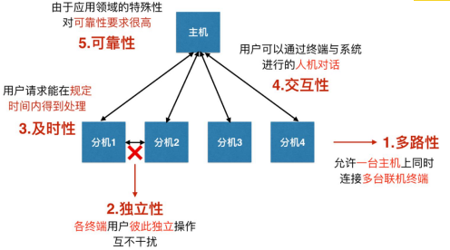

# 精讲01: 《第一章: 操作系统简介》

[TOC]

## 一、操作系统的定义

操作系统是一种复杂的**系统软件**，是不同程序**程序代码**、**数据结构**、**数据初始化文件**的集合，可执行。选择题、填空题、简答题

## 二、用户与硬件之间的接口选择题、填空题

操作系统屏蔽了对硬件的细节，提供了计算机用户与计算机硬件之间的接口，并且通过这个接口使应用程序的开发变的简单、高效。

操作系统必须完成的目标：(承上启下)

1、操作系统**与硬件部分相互作用**，

2、为运行在计算机上的**应用程序提供执行环境**。

## 三、资源的管理者

现在计算机系统的一个重要特点就是支持**多任务**，即允许在同一个系统内同时驻留多个应用程序。选择题、填空题

处理机管理：决定把处理机先分给哪个程序用，后给哪个程序用

内存管理：给程序分配内存空间

设备管理：完成怎么分配设备，分配哪台设备，怎么和设备连接等

文件管理：为每个文件分配空间、建立目录，对目录进行组织管理以及根据用户请求从外存读取数据或将数据写入外存

#### 扩展选择题、填空题

网络操作系统：管理的资源还包括网卡、带宽等。

## 四、操作系统的发展

### 单道批处理系统

 单道批处理系统**内存中只有一道作业**，CPU和内存资源被用户作业独占选择题、填空题

#### 特点：自动性、顺序性、单道性选择题、填空题

选择题、简答题

#### 优点：减少了等待人工操作的时间

#### 缺点：CPU资源不能得到充分利用

### 多道批处理系统

由操作系统的**作业调度程序**，按一定策略从**后备作业对列**中选择**若干**个作业调入内存，使他们共享CPU和系统中的各种资源。选择题、填空题

#### 特点：多道性、无序性、调度性、复杂性选择题、填空题

选择题

#### 优点：

#### 能够提高CPU、内存和IO设备的利用率和系统的吞吐量

#### 缺点：

#### 系统平均周转时间长

#### 缺乏交互能力

### 分时操作系统

允许多个用户通过终端机同时使用计算机，每个用户通过终端与主机交互时都能得到快速响应。选择题

#### 特点：多路性、独立性、及时性、交互性选择题、填空题

选择题

#### 优点：

向用户提供了人机交互的方便性使多个用户可以通过不同的终端共享主机

### 实时操作系统

实时系统必须及时响应外部事件的请求，在规定事件内完成对该事件的处理。主要用于实时控制和实时信息处理领域。选择题、填空题

#### 特点：多路性、独立性、及时性、交互性、可靠性选择题、填空题

## 五、操作系统产品现状选择题

| 操作系统       | 运行主体         | 提供的服务                                                   |
| -------------- | ---------------- | ------------------------------------------------------------ |
| 主机操作系统   | 大型主机         | 批处理、事物处理、分时处理                                   |
| 服务器操作系统 | 网络服务         | 通过网络为众多用户服务，允许用户共享硬件和软件资源。 服务器可提供打印服务、文件服务、web服务 |
| 微机操作系统   | 微型计算机(PC机) | 为单个用户提供良好的应用环境和应用软件开发环境               |
| 嵌入式操作系统 | 嵌入式设备中     | 采用更易于移植的方法，以适应越来越多的新处理器               |

## 六、操作系统的特征选择题、填空题、简答题

现代操作系统都支持**多任务**

具有并发、共享、虚拟和异步性特征。

并发：两个或多个事件在同一时间间隔内发生

共享：系统中的资源可供内存中多个并发执行的进程共同使用

互斥共享：任意时刻一种资源只能被一个进程访问

同时共享：从宏观上看，资源可以被多个进程同时访问，并发与共享的关系是相互依赖的

虚拟：最常用内存虚拟化，用户感觉到的内存大于实际内存

异步：进程以不可预知的速度向前推进

==== END ====